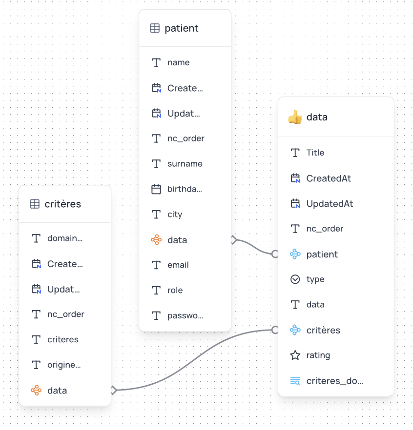

# ONE LIFE+ Health Survey Application


ONE LIFE+ is an AI-powered health assessment platform designed to help healthcare professionals conduct comprehensive health surveys and provide personalized care recommendations. Built during the Doctolib Hackathon, this application demonstrates how AI can enhance patient care and streamline the consultation process.

## 🌟 Features

- **Interactive Health Assessment Wheel**: Visual representation of a patient's health across multiple domains


- **Patient-specific Data**: Secure storage and display of individual patient health data
- **AI-powered Questionnaire**: Smart assessment tool that adapts based on patient responses


- **Authentication & Authorization**: Secure login system ensuring patients only see their own data


- **Responsive UI**: Mobile-friendly interface built with Next.js and Tailwind CSS
- **Data Visualization**: TO BE DONE

## 🔧 Technology Stack

- **Frontend**: Next.js, React, Tailwind CSS, shadcn/ui components
- **Authentication**: NextAuth.js with credential provider
- **State Management**: Zustand
- **Database**: NocoDB (used as backend database service)

- **Styling**: Tailwind CSS with custom theme

## 📋 Project Structure

```
/app
  /api - API routes for data handling
  /auth - Authentication pages
  /components - Reusable UI components
  /dashboard - Patient dashboard views
  /questionnaire - Health survey interface
  /types - TypeScript type definitions
/lib - Utility functions and configuration
/public - Static assets
```

## 🚀 Getting Started

### Prerequisites

- Node.js (v18 or higher)
- npm or yarn
- NocoDB instance (for data storage)

### Environment Setup

Create a `.env.local` file in the root directory with the following variables:

```
NEXTAUTH_URL=http://localhost:3000
NEXTAUTH_SECRET=your_secret_key

# NocoDB Configuration
NOCODB_BASE_URL=your_nocodb_url
NOCODB_API_TOKEN=your_nocodb_api_token
NOCODB_PATIENTS_TABLE_ID=your_patients_table_id
```

### Installation

1. Clone the repository
   ```bash
   git clone <repository-url>
   cd demo_viepro
   ```

2. Install dependencies
   ```bash
   npm install
   # or
   yarn
   ```

3. Run the development server
   ```bash
   npm run dev
   # or
   yarn dev
   ```

4. Open [http://localhost:3000](http://localhost:3000) with your browser to see the application

## 💡 Usage

1. **Registration**: New patients can register for an account
2. **Login**: Existing patients can log in securely
3. **Health Wheel**: View and interact with the health domains wheel
4. **Questionnaire**: Complete health surveys for specific domains
5. **Dashboard**: View comprehensive health metrics and recommendations

## 🔒 Security Features

- Authentication with NextAuth.js
- Data isolation ensuring patients only see their own data
- Server-side session validation
- Role-based access control (patients vs. admin)

## 📝 Development Notes

### Data Model

The application uses several key data structures:

- **Patients**: User accounts with authentication details
- **Domains**: Health categories (e.g., Nutrition, Sleep, Mental Health)
- **Criteria**: Specific aspects within each domain
- **Stars/Ratings**: Patient assessments for each criteria

### Key Components

- **Wheel Component**: Interactive visualization of patient health domains
- **Questionnaire**: AI-driven health assessment interface
- **API Routes**: Secure endpoints for data access and modification

## 🔮 Future Enhancements

- Advanced AI recommendations based on survey responses
- Integration with health tracking devices
- Export functionality for sharing reports with healthcare providers
- Multi-language support
- Expanded health domains and assessment criteria

## 👥 Contributors

This project was developed during the Doctolib Hackathon by Team ViePro:

-  Sophie Dieng sophiedieng0@gmail.com
- Nathalie Victorin moncoachprofessionnel@gmail.com
- Andrey Aristov and@aristov.fr

## 📄 License

This project is private and intended for demonstration purposes only.

---

© 2025 ONE LIFE+. All rights reserved.
